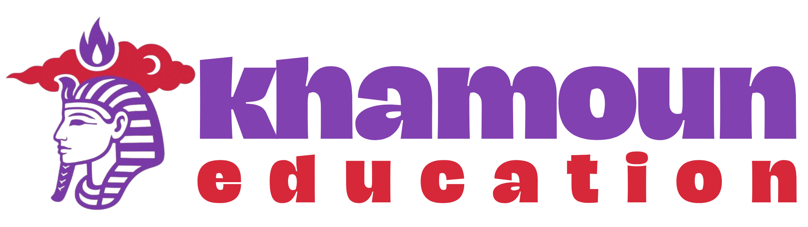

<!-- Banner -->
<div align="center">
  
  <h1>Khamoun Education</h1>
  <p><strong>Plateforme d'apprentissage vidéo pour les élèves du secondaire en Côte d'Ivoire</strong></p>

  <p>
    
    
    
    
    
    
  </p>
</div>

---

## À propos du projet

**Khamoun Education** est une plateforme web qui connecte les élèves du secondaire ivoirien (6ème à Terminale) à des cours filmés directement en classe par leurs enseignants. Les professeurs enregistrent leurs cours en condition réelle, puis les publient sur la plateforme pour que les élèves puissent les réviser à leur rythme, depuis n'importe où.

Le projet s'inscrit dans le programme du **MENA** (Ministère de l'Éducation Nationale et de l'Alphabétisation) et vise à démocratiser l'accès à une éducation de qualité à l'échelle nationale.

---

## Fonctionnalités

### Côté Élève
- Tableau de bord personnalisé avec suivi de progression par matière
- Accès aux cours vidéo classés par niveau (6ème → Terminale) et par matière
- Suivi des devoirs et assignments transmis par les enseignants
- Système de classement (leaderboard) pour stimuler l'engagement

### Côté Enseignant
- Upload de contenus pédagogiques : vidéos de cours (MP4), devoirs (PDF), quiz
- Gestion des élèves par classe avec suivi de la moyenne et de la progression
- Messagerie directe avec les élèves ou par groupe-classe
- Statistiques de rendu (nombre d'élèves ayant soumis un devoir)

### Général
- Authentification sécurisée avec rôles distincts (`student`, `teacher`, `admin`)
- Routes protégées selon le rôle de l'utilisateur
- Design responsive, mobile-first
- Animation de fond (réseau neuronal) pour une identité visuelle forte

---

## Stack technique

| Couche | Technologie |
|---|---|
| Framework | React 18 + Vite 5 |
| Langage | TypeScript 5.2 |
| Styling | Tailwind CSS 3.4 |
| Backend / BaaS | Firebase (Auth + Firestore) |
| Routage | React Router DOM 6 |
| Animations | Motion (Framer Motion) |
| Icônes | Lucide React |
| Déploiement | Vercel |

---

## Architecture du projet

```
src/
├── components/          # Composants réutilisables (Navbar, Logo, ProtectedRoute…)
├── contexts/            # AuthContext — gestion de l'état d'authentification global
├── hooks/               # Hooks personnalisés
├── lib/                 # Utilitaires Firebase (gestion d'erreurs, helpers)
├── pages/
│   ├── LandingPage.tsx  # Page d'accueil publique
│   ├── AuthPage.tsx     # Connexion / Inscription
│   ├── JoinPage.tsx     # Page d'inscription (choix du rôle)
│   ├── DashboardPage.tsx    # Tableau de bord élève
│   └── TeacherDashboard.tsx # Tableau de bord enseignant
├── firebase.ts          # Initialisation Firebase (Auth + Firestore)
└── App.tsx              # Configuration des routes
```

---

## Lancer le projet en local

**Prérequis :** Node.js ≥ 18

```bash
# 1. Cloner le dépôt
git clone https://github.com/Eder225/khamounEducation.git
cd khamounEducation

# 2. Installer les dépendances
npm install

# 3. Configurer Firebase
# Renseigner vos clés dans firebase-applet-config.json

# 4. Démarrer le serveur de développement
npm run dev
```

### Scripts disponibles

```bash
npm run dev       # Serveur de développement (Vite HMR)
npm run build     # Build de production (TypeScript + Vite)
npm run preview   # Prévisualiser le build local
npm run lint      # Vérification ESLint
```

---

## Design system

L'interface adopte un style **Tech / Futuriste Léger** avec des éléments de glassmorphism et un fond animé (réseau neuronal).

| Rôle | Couleur | Hex |
|---|---|---|
| Primaire | Violet | `#8241b0` |
| Secondaire | Rouge | `#d62839` |
| Accentuation | Vert | `#6fb041` |

**Typographie :** Space Grotesk (titres) · Inter (corps de texte)

---

## Auteur

Développé par **Eder** — étudiant en BCA/B.Sc. à PP Savani University, Vadodara, Inde.

---

## Licence

Ce projet est privé. Tous droits réservés.
